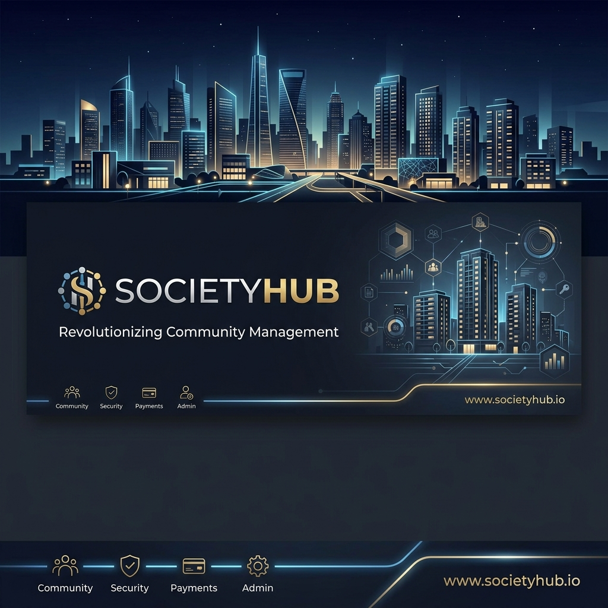

# 🏙️ SocietyHub - Premium Society Management System



[](https://vitejs.dev/)
[](https://reactjs.org/)
[](https://tailwindcss.com/)
[](https://www.typescriptlang.org/)
[](https://ui.shadcn.com/)

**SocietyHub** is a sophisticated, high-performance society management platform designed to streamline residential operations. Built with a focus on modern aesthetics (Glassmorphism, Dark Mode) and seamless user experience, it provides a centralized hub for residents and administrators to manage bills, complaints, notices, and visitors.

---

## ✨ Key Features

### 📊 Advanced Dashboard
- **Real-time Analytics**: Interactive charts for revenue, resident growth, and complaint status.
- **Quick Actions**: One-click access to add residents, generate bills, or post notices.
- **Dynamic Calendar**: View upcoming society events and deadlines at a glance.

### 💳 Financial Management (Bills)
- **Automated Billing**: Effortlessly generate and track monthly maintenance bills.
- **Status Tracking**: Monitor paid and pending dues with detailed breakdowns.
- **History**: Maintain a comprehensive record of all financial transactions.

### 👥 Resident & Staff Directory
- **Unified Management**: Searchable database of all residents with profile details.
- **Role-based Access**: Specialized views for administrators and residents.
- **Unit Tracking**: Map residents to their specific blocks and apartments.

### 📢 Communication Hub
- **Notice Board**: Digital board for broadcasting urgent updates and announcements.
- **Complaint Tracking**: Systematic workflow for logging, tracking, and resolving resident grievances.

### 🛡️ Security & Visitors
- **Visitor Logs**: Real-time tracking of entries and exits.
- **Pre-approvals**: Streamlined process for expected guests and deliveries.

---

## 🛠️ Technical Arsenal

- **Core Framework**: [React 18](https://reactjs.org/) + [TypeScript](https://www.typescriptlang.org/)
- **Build Tool**: [Vite](https://vitejs.dev/)
- **Styling Engine**: [Tailwind CSS](https://tailwindcss.com/) with `tailwindcss-animate`
- **UI Components**: [Shadcn UI](https://ui.shadcn.com/) (Radix UI primitives)
- **Icons**: [Lucide React](https://lucide.dev/)
- **Data Fetching**: [TanStack Query (FKA React Query)](https://tanstack.com/query/latest)
- **Forms**: [React Hook Form](https://react-hook-form.com/) + [Zod](https://zod.dev/)
- **Charts**: [Recharts](https://recharts.org/)
- **Theme Management**: `next-themes` (Seamless Dark/Light mode)

---

## 🚀 Getting Started

### Prerequisites
- Node.js (v18 or higher)
- npm or bun

### Installation

1. **Clone the repository**
   ```bash
   git clone https://github.com/aadii-chavan/society-hub.git
   cd society-hub
   ```

2. **Install dependencies**
   ```bash
   npm install
   # or
   bun install
   ```

3. **Start the development server**
   ```bash
   npm run dev
   ```

4. **Build for production**
   ```bash
   npm run build
   ```

---

## 🎨 Design Philosophy

SocietyHub follows a **Premium Dark Aesthetic** with:
- **Glassmorphism**: Subtle backdrop blurs and translucent surfaces.
- **Dynamic Glows**: Accent-colored glows to highlight interactive elements.
- **Micro-animations**: Smooth transitions using Framer Motion (where applicable) and Tailwind Animate.
- **Accessibility**: High contrast ratios and responsive layouts for all devices.

---

## 🤝 Contributing

Contributions are welcome! Please feel free to submit a Pull Request.

---

## 📄 License

This project is licensed under the MIT License.

---

<p align="center">
  Made with ❤️ by <a href="https://github.com/aadii-chavan">Aditya Chavan</a>
</p>
